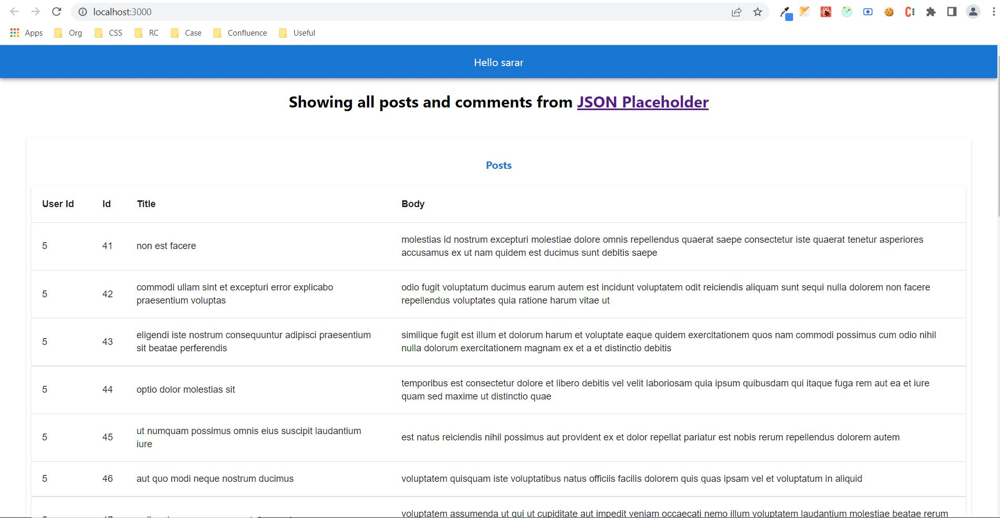

# react-posts-comments

A sample react based application for displaying posts &amp; comments

## Steps to execute

- npm install
- npm run start

- Application should be running on port 3000 (http://localhost:3000)

## Sample screenshot of application

